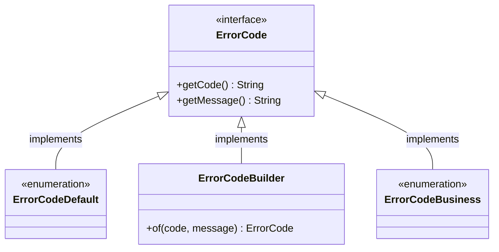

# 错误码

调用 API 出现错误时，可以根据错误码信息来定位问题并尝试解决。



## 错误码接口

MuYie 框架提供了一个标准的错误码接口，所有自定义错误码均需实现该接口，以便统一异常处理。

```java title="错误码接口"
package com.muyie.exception;

public interface ErrorCode {

    /**
     * 接口返回码字段，请求成功时返回[00000]，请求失败时返回错误码。
     */
    String getCode();

    /**
     * 接口返回信息字段，请求成功返回[成功]，请求失败返回错误原因。
     */
    String getMessage();

}
```

## 公共错误码

公共错误码是基于阿里巴巴 Java 开发手册（黄山版）实现的，在此基础上增加了部分常见的 HTTP 状态码的错误描述信息。

```java title="公共错误码"
package com.muyie.exception;

public enum ErrorCodeDefault implements ErrorCode {

    // 正确执行后的返回
    SUCCESS("00000", "成功"),

    // 未知异常错误码（常见的 HTTP 状态码的错误描述信息）
    S0400("S0400", "请求参数错误"),
    S0401("S0401", "请求认证失败"),
    S0403("S0403", "请求被拒绝"),
    S0404("S0404", "请求资源不存在"),
    S0405("S0405", "请求方法不支持"),
    S0408("S0408", "请求超时"),
    S0409("S0409", "请求无法完成"),
    S0413("S0413", "请求实体过大"),
    S0415("S0415", "媒体类型不支持"),
    S0429("S0429", "请求频繁"),
    S0500("S0500", "服务端错误"),
    S0502("S0502", "请求网关错误"),
    S0503("S0503", "服务不可用"),
    S0504("S0504", "请求网关超时"),

    // 错误码列表 - 阿里巴巴 Java 开发手册（黄山版）
    A0001("A0001", "用户端错误"),
    A0100("A0100", "用户注册错误"),
    A0101("A0101", "用户未同意隐私协议"),
    A0102("A0102", "注册国家或地区受限"),
    A0110("A0110", "用户名校验失败"),
    A0111("A0111", "用户名已存在"),
    A0112("A0112", "用户名包含敏感词"),
    A0113("A0113", "用户名包含特殊字符"),
    A0120("A0120", "密码校验失败"),
    A0121("A0121", "密码长度不够"),
    A0122("A0122", "密码强度不够"),
    A0130("A0130", "校验码输入错误"),
    A0131("A0131", "短信校验码输入错误"),
    A0132("A0132", "邮件校验码输入错误"),
    A0133("A0133", "语音校验码输入错误"),
    A0140("A0140", "用户证件异常"),
    A0141("A0141", "用户证件类型未选择"),
    A0142("A0142", "大陆身份证编号校验非法"),
    A0143("A0143", "护照编号校验非法"),
    A0144("A0144", "军官证编号校验非法"),
    A0150("A0150", "用户基本信息校验失败"),
    A0151("A0151", "手机格式校验失败"),
    A0152("A0152", "地址格式校验失败"),
    A0153("A0153", "邮箱格式校验失败"),
    A0200("A0200", "用户登录异常"),
    A0201("A0201", "用户账户不存在"),
    A0202("A0202", "用户账户被冻结"),
    A0203("A0203", "用户账户已作废"),
    A0210("A0210", "用户密码错误"),
    A0211("A0211", "用户输入密码错误次数超限"),
    A0220("A0220", "用户身份校验失败"),
    A0221("A0221", "用户指纹识别失败"),
    A0222("A0222", "用户面容识别失败"),
    A0223("A0223", "用户未获得第三方登录授权"),
    A0230("A0230", "用户登录已过期"),
    A0240("A0240", "用户验证码错误"),
    A0241("A0241", "用户验证码尝试次数超限"),
    A0300("A0300", "访问权限异常"),
    A0301("A0301", "访问未授权"),
    A0302("A0302", "正在授权中"),
    A0303("A0303", "用户授权申请被拒绝"),
    A0310("A0310", "因访问对象隐私设置被拦截"),
    A0311("A0311", "授权已过期"),
    A0312("A0312", "无权限使用 API"),
    A0320("A0320", "用户访问被拦截"),
    A0321("A0321", "黑名单用户"),
    A0322("A0322", "账号被冻结"),
    A0323("A0323", "非法 IP 地址"),
    A0324("A0324", "网关访问受限"),
    A0325("A0325", "地域黑名单"),
    A0330("A0330", "服务已欠费"),
    A0340("A0340", "用户签名异常"),
    A0341("A0341", "RSA 签名错误"),
    A0400("A0400", "用户请求参数错误"),
    A0401("A0401", "包含非法恶意跳转链接"),
    A0402("A0402", "无效的用户输入"),
    A0410("A0410", "请求必填参数为空"),
    A0411("A0411", "用户订单号为空"),
    A0412("A0412", "订购数量为空"),
    A0413("A0413", "缺少时间戳参数"),
    A0414("A0414", "非法的时间戳参数"),
    A0420("A0420", "请求参数值超出允许的范围"),
    A0421("A0421", "参数格式不匹配"),
    A0422("A0422", "地址不在服务范围"),
    A0423("A0423", "时间不在服务范围"),
    A0424("A0424", "金额超出限制"),
    A0425("A0425", "数量超出限制"),
    A0426("A0426", "请求批量处理总个数超出限制"),
    A0427("A0427", "请求 JSON 解析失败"),
    A0430("A0430", "用户输入内容非法"),
    A0431("A0431", "包含违禁敏感词"),
    A0432("A0432", "图片包含违禁信息"),
    A0433("A0433", "文件侵犯版权"),
    A0440("A0440", "用户操作异常"),
    A0441("A0441", "用户支付超时"),
    A0442("A0442", "确认订单超时"),
    A0443("A0443", "订单已关闭"),
    A0500("A0500", "用户请求服务异常"),
    A0501("A0501", "请求次数超出限制"),
    A0502("A0502", "请求并发数超出限制"),
    A0503("A0503", "用户操作请等待"),
    A0504("A0504", "WebSocket 连接异常"),
    A0505("A0505", "WebSocket 连接断开"),
    A0506("A0506", "用户重复请求"),
    A0600("A0600", "用户资源异常"),
    A0601("A0601", "账户余额不足"),
    A0602("A0602", "用户磁盘空间不足"),
    A0603("A0603", "用户内存空间不足"),
    A0604("A0604", "用户 OSS 容量不足"),
    A0605("A0605", "用户配额已用光"),
    A0700("A0700", "用户上传文件异常"),
    A0701("A0701", "用户上传文件类型不匹配"),
    A0702("A0702", "用户上传文件太大"),
    A0703("A0703", "用户上传图片太大"),
    A0704("A0704", "用户上传视频太大"),
    A0705("A0705", "用户上传压缩文件太大"),
    A0800("A0800", "用户当前版本异常"),
    A0801("A0801", "用户安装版本与系统不匹配"),
    A0802("A0802", "用户安装版本过低"),
    A0803("A0803", "用户安装版本过高"),
    A0804("A0804", "用户安装版本已过期"),
    A0805("A0805", "用户 API 请求版本不匹配"),
    A0806("A0806", "用户 API 请求版本过高"),
    A0807("A0807", "用户 API 请求版本过低"),
    A0900("A0900", "用户隐私未授权"),
    A0901("A0901", "用户隐私未签署"),
    A0902("A0902", "用户摄像头未授权"),
    A0903("A0903", "用户相机未授权"),
    A0904("A0904", "用户图片库未授权"),
    A0905("A0905", "用户文件未授权"),
    A0906("A0906", "用户位置信息未授权"),
    A0907("A0907", "用户通讯录未授权"),
    A1000("A1000", "用户设备异常"),
    A1001("A1001", "用户相机异常"),
    A1002("A1002", "用户麦克风异常"),
    A1003("A1003", "用户听筒异常"),
    A1004("A1004", "用户扬声器异常"),
    A1005("A1005", "用户 GPS 定位异常"),
    B0001("B0001", "系统执行出错"),
    B0100("B0100", "系统执行超时"),
    B0101("B0101", "系统订单处理超时"),
    B0200("B0200", "系统容灾功能被触发"),
    B0210("B0210", "系统限流"),
    B0220("B0220", "系统功能降级"),
    B0300("B0300", "系统资源异常"),
    B0310("B0310", "系统资源耗尽"),
    B0311("B0311", "系统磁盘空间耗尽"),
    B0312("B0312", "系统内存耗尽"),
    B0313("B0313", "文件句柄耗尽"),
    B0314("B0314", "系统连接池耗尽"),
    B0315("B0315", "系统线程池耗尽"),
    B0320("B0320", "系统资源访问异常"),
    B0321("B0321", "系统读取磁盘文件失败"),
    C0001("C0001", "调用第三方服务出错"),
    C0100("C0100", "中间件服务出错"),
    C0110("C0110", "RPC 服务出错"),
    C0111("C0111", "RPC 服务未找到"),
    C0112("C0112", "RPC 服务未注册"),
    C0113("C0113", "接口不存在"),
    C0120("C0120", "消息服务出错"),
    C0121("C0121", "消息投递出错"),
    C0122("C0122", "消息消费出错"),
    C0123("C0123", "消息订阅出错"),
    C0124("C0124", "消息分组未查到"),
    C0130("C0130", "缓存服务出错"),
    C0131("C0131", "key 长度超过限制"),
    C0132("C0132", "value 长度超过限制"),
    C0133("C0133", "存储容量已满"),
    C0134("C0134", "不支持的数据格式"),
    C0140("C0140", "配置服务出错"),
    C0150("C0150", "网络资源服务出错"),
    C0151("C0151", "VPN 服务出错"),
    C0152("C0152", "CDN 服务出错"),
    C0153("C0153", "域名解析服务出错"),
    C0154("C0154", "网关服务出错"),
    C0200("C0200", "第三方系统执行超时"),
    C0210("C0210", "RPC 执行超时"),
    C0220("C0220", "消息投递超时"),
    C0230("C0230", "缓存服务超时"),
    C0240("C0240", "配置服务超时"),
    C0250("C0250", "数据库服务超时"),
    C0300("C0300", "数据库服务出错"),
    C0311("C0311", "表不存在"),
    C0312("C0312", "列不存在"),
    C0321("C0321", "多表关联中存在多个相同名称的列"),
    C0331("C0331", "数据库死锁"),
    C0341("C0341", "主键冲突"),
    C0400("C0400", "第三方容灾系统被触发"),
    C0401("C0401", "第三方系统限流"),
    C0402("C0402", "第三方功能降级"),
    C0500("C0500", "通知服务出错"),
    C0501("C0501", "短信提醒服务失败"),
    C0502("C0502", "语音提醒服务失败"),
    C0503("C0503", "邮件提醒服务失败"),

    ;

    private final String code;
    private final String message;

    ErrorCodeDefault(String code, String message) {
        this.code = code;
        this.message = message;
    }

    @Override
    public String getCode() {
        return code;
    }

    @Override
    public String getMessage() {
        return message;
    }

}
```

## 自定义错误码

业务系统根据需要自定义错误码，实现 ErrorCode 接口即可。

```java title="自定义错误码"
public enum ErrorCodeBusiness implements ErrorCode {

    // 自定义错误码
    E0001("E0001", "业务处理异常"),

    ;

    private final String code;
    private final String message;

    ErrorCodeBusiness(String code, String message) {
        this.code = code;
        this.message = message;
    }

    @Override
    public String getCode() {
        return code;
    }

    @Override
    public String getMessage() {
        return message;
    }

}
```

## 错误码构建类

如果你不想自定义错误码枚举类，也可以使用错误码构建类来创建错误码。

```java title="错误码构建类"
package com.muyie.exception;

public class ErrorCodeBuilder implements ErrorCode {

    private final String code;
    private final String message;

    private ErrorCodeBuilder(String code, String message) {
        this.code = code;
        this.message = message;
    }

    /**
     * 构建错误码和错误信息，针对已定义并使用占位符的错误信息进行格式化填充, {key} 表示占位符
     *
     * @param errorCode 错误码
     * @param map       对象集合
     * @return 错误码
     */
    public static ErrorCode of(ErrorCode errorCode, Map<?, ?> map) {
        return of(errorCode.getCode(), StrUtil.format(errorCode.getMessage(), map));
    }

    /**
     * 构建错误码和错误信息，针对已定义并使用占位符的错误信息进行格式化填充, {} 表示占位符
     *
     * @param errorCode 错误码
     * @param params    可变数组
     * @return 错误码
     */
    public static ErrorCode of(ErrorCode errorCode, Object... params) {
        return of(errorCode.getCode(), StrUtil.format(errorCode.getMessage(), params));
    }

    /**
     * 构建错误码和错误信息，针对已定义的错误码，重写错误信息
     *
     * @param errorCode 错误码
     * @param message   错误信息
     * @return 错误码
     */
    public static ErrorCode of(ErrorCode errorCode, String message) {
        return of(errorCode.getCode(), message);
    }

    /**
     * 构建错误码和错误信息，针对已定义的错误码，重写错误信息
     *
     * @param errorCode 错误码
     * @param message   错误信息 - 格式化文本, {key} 表示占位符
     * @param map       对象集合
     * @return 错误码
     */
    public static ErrorCode of(ErrorCode errorCode, String message, Map<?, ?> map) {
        return of(errorCode.getCode(), StrUtil.format(message, map));
    }

    /**
     * 构建错误码和错误信息，针对已定义的错误码，重写错误信息
     *
     * @param errorCode 错误码
     * @param message   错误信息 - 格式化文本, {} 表示占位符
     * @param params    可变数组
     * @return 错误码
     */
    public static ErrorCode of(ErrorCode errorCode, String message, Object... params) {
        return of(errorCode.getCode(), StrUtil.format(message, params));
    }

    /**
     * 构建错误码和错误信息
     *
     * @param code    错误码
     * @param message 错误信息
     * @return 错误码
     */
    public static ErrorCode of(String code, String message) {
        return new ErrorCodeBuilder(code, message);
    }

    /**
     * 构建错误码和错误信息，支持使用占位符的错误信息进行格式化填充, {key} 表示占位符
     *
     * @param code    错误码
     * @param message 错误信息 - 格式化文本, {key} 表示占位符
     * @param map     对象集合
     * @return 错误码
     */
    public static ErrorCode of(String code, String message, Map<?, ?> map) {
        return new ErrorCodeBuilder(code, StrUtil.format(message, map));
    }

    /**
     * 构建错误码和错误信息，支持使用占位符的错误信息进行格式化填充, {} 表示占位符
     *
     * @param code    错误码
     * @param message 错误信息 - 格式化文本, {} 表示占位符
     * @param params  可变数组
     * @return 错误码
     */
    public static ErrorCode of(String code, String message, Object... params) {
        return new ErrorCodeBuilder(code, StrUtil.format(message, params));
    }

    @Override
    public String getCode() {
        return code;
    }

    @Override
    public String getMessage() {
        return message;
    }

}
```
