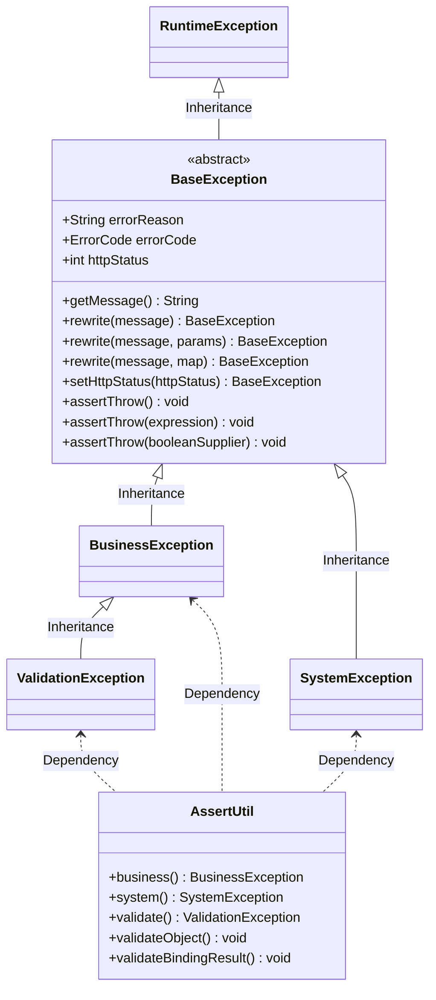

# 异常类

MuYie 框架定义了 Exception 的相关规范，一是为了复用；二是全局异常处理。

| 异常类                | 说明 |
 |-------------------------|----------------------------| 
| BaseException        | 异常基类（抽象类），自定义异常继承该类，便于全局异常处理。             | 
| BusinessException    | 业务处理异常，有明确的业务语义，不需要记录错误（Error） 日志，不需要重试（Retry）。       | 
| SystemException      | 已知的系统异常，需要记录错误（Error）日志，可以重试（Retry）。              | 
| ValidationException  | 请求参数校验异常，有明确的错误语义，不需要记录错误（Error）日志，不需要重试（Retry）。    |
| AssertUtil           | 异常工具类，支持参数校验异常（validate）、业务处理异常（business）、已知的系统异常（system）、对象校验（validateObject）、Spring Web 参数校验（BindingResult）。 | 
| Exception            | 未知的系统异常，需要记录完整的错误（Error Stack）日志，可以重试（Retry）。                   | 



**示例. 业务处理异常**

``` title="示例"
// 1. throw 显示抛出异常
throw AssertUtil.business(ErrorCodeDefault.A0111);

// 2. assertThrow 隐式抛出异常
AssertUtil.business(ErrorCodeDefault.A0111).assertThrow();

// 3. 满足条件时抛出异常
boolean expression = checkUserNameUnique(userName);
AssertUtil.business(ErrorCodeDefault.A0111)
    
    // 重写错误码的错误消息（可选）
    .rewrite("用户名已存在，请重新填写")
    
    // 设置异常的响应状态码（可选）
    .setHttpStatus(HttpStatus.BAD_REQUEST)
    
    // 满足条件时抛出异常（表达式）
    .assertThrow(expression);

// 4. 满足条件时抛出异常（BooleanSupplier）
AssertUtil.validate().assertThrow(() -> {
    return true;
});

// 5. 对象校验（Hibernate Validator）
User user = new User();
user.setUserName("tsollu");
AssertUtil.validateObject(user);

// 6. Spring Web 参数校验（BindingResult）
AssertUtil.validateBindingResult(bindingResult);
```

## 异常工具类

异常工具类（AssertUtil）的提供了一些静态方法，支持参数校验异常（validate）、业务处理异常（business）、已知的系统异常（system）、对象校验（validateObject）、Spring
Web 参数校验（BindingResult）。

``` title="AssertUtil.java"
/**
 * 业务异常
 *
 * @param errorCode   错误码
 * @param errorReason 错误原因
 * @param cause       异常信息
 * @return BusinessException 业务异常
 */
public static BusinessException business(ErrorCode errorCode){}
public static BusinessException business(ErrorCode errorCode, String errorReason);
public static BusinessException business(ErrorCode errorCode, Throwable cause);
public static BusinessException business(ErrorCode errorCode, String errorReason, Throwable cause);

/**
 * 已知的系统异常
 *
 * @param errorCode   错误码
 * @param errorReason 错误原因
 * @param cause       异常信息
 * @return SystemException 已知的系统异常
 */
public static SystemException system(ErrorCode errorCode);
public static SystemException system(ErrorCode errorCode, String errorReason);
public static SystemException system(ErrorCode errorCode, Throwable cause);
public static SystemException system(ErrorCode errorCode, String errorReason, Throwable cause);

/**
 * 请求参数校验异常
 *
 * @param errorReason 错误原因
 * @param cause       异常信息
 * @return ValidationException 请求参数校验异常
 */
public static ValidationException validate();
public static ValidationException validate(String errorReason);
public static ValidationException validate(Throwable cause);
public static ValidationException validate(String errorReason, Throwable cause);

/**
 * 基于注解的对象校验，抛出业务异常
 *
 * @param errorCode 错误码
 * @param object    校验对象
 * @param groups    分组校验
 * @throws BusinessException 业务异常
 */
public static void validateObject(ErrorCode errorCode, Object object, Class<?>... groups);
public static void validateObject(ErrorCode errorCode, Object object);
public static void validateObject(Object object, Class<?>... groups);
public static void validateObject(Object object);

/**
 * 前端请求参数校验，抛出请求参数异常
 *
 * @param bindingResult 前端请求参数校验
 * @throws ValidationException 请求参数校验异常
 */
public static void validateBindingResult(BindingResult bindingResult);
```
